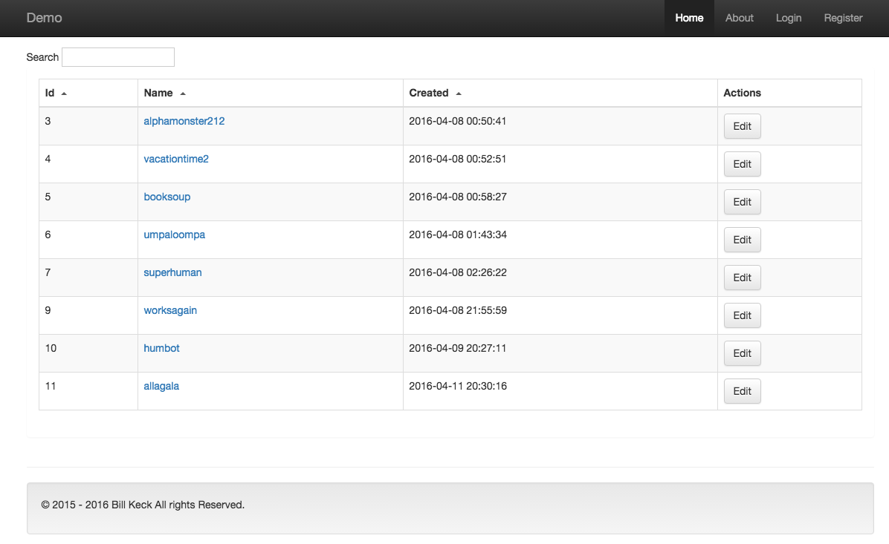

# ViewMaker For Laravel 5.2

[![Latest Version on Packagist][ico-version]][link-packagist]
[![Software License][ico-license]](LICENSE.md)
[![Total Downloads][ico-downloads]][link-downloads]

ViewMaker is for use with the Laravel PHP framework (5.2 and up). It's a plugin for the artisan command line 
tool that ships with Laravel.

ViewMaker creates a make:views artisan command that lets you quickly scaffold views for create, show, edit, and index, 
based on your input.  You simply input a model name, master page name and template type (plain, basic, dt, or vue), 
and the view folder and corresponding views are made for you instantly.  Our dt and vue templates come with working
js datagrids out of the box.  

VeiwMaker also has a powerful make:foundation command that puts it all together for you.  It creates a model from 
scratch with corresponding migration, routes, controllers and views, forming a basic crud app, with searchable, 
sortable columns.  It also builds a basic unit test and sets up your factory for quick population of seed data.

ViewMaker also ships with a make:crud command, which creates the model, migration, routes, controllers, factory, and test
without the views, in case you want to create those separately.

I hope you enjoy this plugin and find it useful.  I don’t have a donate button, but If you would like 
to support my work and learn more about Laravel, you can do so by buying one of 
my books, [Laraboot: laravel 5.2 For Beginners](https://leanpub.com/laravel-5-for-beginners-laraboot), 
I really appreciate it.

## Install

Via Composer

```
composer require evercode1/view-maker
```

In your app/config/app.php file, add the following to the providers array:

```
Evercode1\ViewMaker\ViewMakerServiceProvider::class,
```

## Usage

## Summary

ViewMaker will install 3 artisan commands, make:views, make:crud, and make:foundation.

Use make:views to create views, including:

* appropriately-named view folder
* index 
* create
* edit
* show  

Use make:crud to create the files necessary to display a view:

* model
* controller
* api controller (if it does not yet exist)
* migration
* test

make:crud also appends to the following files:

* routes.php
* ModelFactory.php
* ApiController (if it already exists)

Use make:foundation to create all files, including:

* model
* controller
* api controller (if it does not yet exist)
* migration
* test
* appropriately-named view folder
* index view
* create view
* edit view
* show view

make:foundation also appends to the following files:

* routes.php
* ModelFactory.php
* ApiController (if it already exists)

Please note:

ViewMaker templates assume you use and have a master page.  If you want to take advantage of
working grid templates, then you will need the following:

* a master page in a folder named layouts in your views folder
* To use the DataTables template, jquery is a dependency
* jquery must be called first by you (most likely in your masterpage)
* To use the DataTables, you need an @yield('css') tag on your master page
* To use ajax for grids, you need a meta tag for the csrf token in your master page

example for csrf token:

```
<meta name="csrf-token" content="{!! csrf_token() !!}">
```
Obviously, if you are not using our make:crud or make:foundation commands first, you will need to write your
model, route, migration, and controllers in order to be able to see the views created by ViewMaker in your
application.

All of these requirements are listed in detail below, but since they are common sources of bugs,
I have listed them up here.  You can use it as a check list to make sure you have what you need to
use ViewMaker successfully.

## make:foundation Workflow

To fully understand the power of the make:foundation command, let's walk through a typcial use case.  For this,
we will assume that you have a master page named master.blade.php in your layouts folder, which is in your views folder.  

Before we start, in your masterpage, you should have your csfr token:

```
<meta name="csrf-token" content="{!! csrf_token() !!}">
```

Your masterpage should also have your css tag;

```
@yield('css')
```

and in the scripts section of your masterpage, you should have your call to jquery, for example:

```
<script src="//ajax.googleapis.com/ajax/libs/jquery/1.11.3/jquery.min.js"></script>
```

You need to make sure that is all there before running the command, otherwise
the views containing ajax and grids will not function properly.

Now we're ready to try the make:foundation command.  Let's create a Widget 
foundation with the following command:

```
php artisan make:foundation Widget master dt
```

After that runs, we're ready to migrate up to our db.  To keep it simple, let's just migrate what we have:

```
php artisan migrate
```

Everything should work at this point, but there is no data.  So let's run a unit test to add 
a single record by running from the command line:

```
vendor/bin/phpunit
```

You should get green and a record in the db. It's a very basic test and it should pass. 

If your test fails:

Some versions of Laravel 5.2 require your routes to be in a web group.  Since 
the new routes we made are just appended to the end of the file, you may need
to move them inside a route group, depending on your version of Laravel.

The test can also fail if another test, like ExampleTest, is having a problem and crashes
the program.  In that case fix or remove the broken tests, and make sure your route group is correct, 
in some versions you need one, in some versions you don't, and that should solve the problem.

Next you can use the factory to seed the db.  We start by calling tinker:

```
php artisan tinker
```

Then the following command:

```
factory('App\Widget', 30)->create();
```

Then control D from the command line to quit tinker.

If you don't want to use tinker, manually add some records via the create form.

With that you should be able to go to your /widget route and see the following:


Please note that the header and footer pictured above are called in by the master page, so you will see
the output of your masterpage instead.

## make:views

The make views lets you quickly scaffold views for create, show, edit, and index, based on your input.

The make:views command has  the following arguments:

```
php artisan make:views {ModelName} {MasterPageName} {TemplateType}
```

Before running make:views, at a minimum, you should already have your model, route and controller created.
As an alternative to doing that manually, you can use ViewMaker's make:crud command to do it for you.  Or
you could use make:foundation to create everything all at once.

In any event before you do this, you also need to have your master page ready.

So for example, if you had a model named Widget, and you  had a master page 
named master.blade.php, you may do one of the following:

```
php artisan make:views Widget master plain
```

```
php artisan make:views Widget master basic
```

```
php artisan make:views Widget master dt
```

```
php artisan make:views Widget master vue
```

The plain template creates simple stubs, the basic template gives you a 
couple of working forms and the dt and vue templates give you a working data 
grid implementation with search and column sorts.  

The templates are described in detail in subsequent sections.  Also see the Prerequisite Tips
section to make sure you have what you need before running this.  And finally, check out the conventions
section for naming tips on models and instance variables, so you know what to expect there.

## make:crud

```
php artisan make:crud Widget
```

The make:crud command takes a single argument, the name of the model you wish to build your crud on.  Since
the make:crud command builds the model for you, all you need is a name.  The make:crud command will create
the following file types:

* model
* controller
* api controller (if it does not yet exist)
* migration
* test

It also appends to the following files:

* routes.php
* ModelFactory.php
* ApiController (if it already exists)

You could then run the make:views command and have it functional, once you've migrated and seeded data or created a 
few records.

## make:foundation

The make:foundation command has the following arguments:

```
php artisan make:foundation {ModelName} {MasterPageName} {TemplateType}
```

So for example, if you wanted to create a model named Widget, and you had a master page 
named master.blade.php, you may do one of the following:

```
php artisan make:foundation Widget master plain
```

```
php artisan make:foundation Widget master basic
```

```
php artisan make:foundation Widget master dt
```

```
php artisan make:foundation Widget master vue
```

make:foundation will create the following:

* model
* controller
* api controller (if it does not yet exist)
* migration
* test
* appropriately-named view folder
* index view
* create view
* edit view
* show view

make:foundation also appends to the following files:

* routes.php
* ModelFactory.php
* ApiController (if it already exists)

## Prerequisite Tips

To use the make:views or make:foundation command successfully, you need the following:

* a master page in a folder named layouts in your views folder
* To use the DataTables template, jquery is a dependency
* jquery must be called first by you (most likely in your masterpage)
* To use the DataTables, you need an @yield('css') tag on your master page
* To use ajax for grids, you need a meta tag for the csrf token in your master page

example for csrf token:

```
<meta name="csrf-token" content="{!! csrf_token() !!}">
```
 If you need to reference what a master page is, here is the info:
 
[Master Page Docs in Laravel](https://laravel.com/docs/5.2/blade#template-inheritance)

To call in jquery, you may do so by CDN in your scripts section of your master page:

```
<script src="//ajax.googleapis.com/ajax/libs/jquery/1.11.3/jquery.min.js"></script>
```

Please refer to the actual CDN for the newest link.

In the css section of your master page or related partial, make sure you have the following:

```
@yield('css')
```

That should come after bootstrap or whatever your main css is.

## Plain Templates

Using plain for template type will  create a widget folder in your views 
directory, and then within that folder, the following files:

* create
* show
* edit
* index

All blade files will extend whatever value for master page that you inputted 
on the command.  In the example above, the master page is named master.blade.php, 
so we used 'master'.  

If for whatever reason you are not using a master page for your application, 
then you will have to go to each file and remove the @extends directive.
  
Since most applications will use a masterpage for common html markup, extending 
the master page is included in the plain templates.

When using plain as the template type, you get the view folder and and the 4 view 
files.  In each file, you get the extends directive and a single \<h1> tag,  
for example in create.blade.php, you would see:

"This is your Widget Create page"

And that’s it.  So use plain if you just want to stub out the folder and the files, 
this can still be a time-saver.

## Basic Templates

Many times, we need to do rapid prototyping, so we have a very simple and minimal 
bootstrap implementation named ‘basic’.   The artisan command is for that is as 
example:

```
php artisan make:views widget master basic
```

Using ‘basic’ for template type will  create a widget folder in your views directory, 
and then within that folder, the following files:

* create
* show
* edit
* index

This will give you an input forms for create and edit and a show page and a simple 
index page.


Above you can see that you are provided with a single input for widget name, which 
in the form will be labelled widget_name.  The convention for fieldname is 
$modelName . ‘_name’.  If you follow a different convention, then you will have to 
change the value of the field name in all the appropriate spots.  Please see the 
conventions section for tips on how the templates are formatted.

Note that that the header and footer in the sample above are brought in by extending 
the master page, they will not be generated by the ViewMaker.  

The action on the above form is set to POST  to /widget, with the appropriate token set 
to avoid csrf.  That actual posting of the form depends on you having a model, route, 
controller and db setup.  None of that is created for you by ViewMaker.  That said, 
these templates are designed to work with a route resource, so if you had the following 
in your routes file:

```
Route::resource('widget', 'WidgetController'):
```

That would obviously point to a WidgetController, which you have to make on your own.  
If you want the form to actually function, you need to write your update method on your 
controller.  

You can see a basic implementation of the model, migration, route, and controller that 
support the basic views at:

[demo](https://github.com/evercode1/package-for-views)

Please note that is the code on github, not a live demo.

Since the templates only provide for a single field, it is easy to add fields, modify 
the html markup and css to suit your own tastes and needs.  Using the make:views command 
is a starting point that will get you up and running quickly.

## Datatables Templates

Sometimes we need to do quick prototyping of data grids.  With our datatables implementation,
you get all of the views that come with basic, but you get also get a working data grid
on the index page.

Our dt template is a simple implementation of jquery datatables, which can get you up 
and running quickly with a sortable, searchable grid.  The command for that looks like 
this:

```
php artisan make:views widget master dt
```

Assuming you have some records, and have set up your route, model, migration, api route, 
and controller, that will get you the following:


Again note the header and footer are brought in by master page, which you create 
separately on your own.  If you need an example to follow, use the demo site at:

[demo](https://github.com/evercode1/package-for-views)

You can copy the master.blade.php and related files from there if you wish to.

When you run the make:views command with ‘dt’, you get two additional view pages.  
One is datatable.blade.php, which holds the table partial.  The other is 
datatable-script.blade.php, which holds the datatable script.

As long as you have included in your scripts in your master page or related files:

```
<script src="//cdn.datatables.net/1.10.7/js/jquery.dataTables.min.js"></script>
```

That has a jquery dependency, so you will need to put that after your jquery call.  
You also need the following css:

```
<link rel="stylesheet" href="//cdn.datatables.net/1.10.7/css/jquery.dataTables.min.css">
```
You also need a meta tag:

```
<meta name="csrf-token" content="{!! csrf_token() !!}">
```
You can see how I did all this in the demo app:

[demo](https://github.com/evercode1/package-for-views)

Please note that is the code, not a live demo.  But you can see how I structured the 
master page and the cdn calls.

The ViewMaker will get you up and running quickly, but you should move your 
datatable-script.blade js code to a permanent home, such as in public/js folder 
or assets/js or some other location for your js assets.  It’s up to you how you 
want to organize that.

In addition to having the route resource and matching controller, you also need a route 
for your api call, which again, using widget as an example, would be:

```
Route::any('api/widget', 'ApiController@widgetData');
```

This assumes you have a controller named ApiController.  I’m using any as the verb here 
so I can do a get request to debug.  You also need to format the json response a specific 
way,  so for example, you api controller could look like this:

~~~~

<?php

namespace App\Http\Controllers;

use Illuminate\Http\Request;

use App\Http\Requests;
use DB;

class ApiController extends Controller
{
   public function widgetData(){

       $result['data'] = DB::table('widgets')
                       ->select('id',
                                'widget_name',
                                'created_at')
                       ->get();

       return json_encode($result);

   }
}

~~~~

Obviously, you can add new columns to the select statement as you require them, as long 
as you have added them in your db.  You would also have to have a corresponding table 
row on your datatable.blade.php partial.  And of course you would have to modify your 
script to account for additional columns.

Datatables is a popular jquery plugin, the docs are here:

[Datatables](https://datatables.net/)

## Vue.js Templates

Sometimes we need to do quick prototyping of data grids and we want to use vue.js.
With our vue.js implementation, you get all of the views that come with basic, but 
you get also get a working data grid on the index page.

Our vue template is a simple implementation of a vue.js grid component, which can get you up 
and running quickly with a sortable, searchable grid.  The command for that looks like 
this:

```
php artisan make:views widget master vue
```

Assuming you have some records, and have set up your route, model, migration, api route, 
and controller, that will get you the following on your index page:



Again note the header and footer are brought in by master page, which you create 
separately on your own.  If you need an example to follow, use the demo site at:

[demo](https://github.com/evercode1/package-for-views)

You can copy the master.blade.php and related files from there if you wish to.

You also need a meta tag, which will create the tokens for your ajax calls,
so put it in the appropriate place in your head section:

```
<meta name="csrf-token" content="{!! csrf_token() !!}">
```
You can see how I did all this in the demo app:

[demo](https://github.com/evercode1/package-for-views)

I break out my meta section as a view partial, which gets called into master.blade.php,
but you can do it any way you want as long as you have it in there correctly.

Please note that is the code, not a live demo.  But you can see how I structured the 
master page and the cdn calls.

When you run the make:views command with ‘vue’, you get your script, template, and css
all included on the same index page.  You also get create.blade.php, edit.blade.php, and show.blade.php,
but those are the same as the basic template, so refer to that for what those will look like.

The ViewMaker will get you up and running quickly, but you should move your 
vue js code to a permanent home, such as in public/js folder 
or assets/js or some other location for your js assets.  It’s up to you how you 
want to organize that.  The same is true for the css that I provided for it.

In addition to having the route resource and matching controller, you also need a route 
for your api call, which again, using widget as an example, would be:

```
Route::any('api/widget-vue', 'ApiController@widgetVueData');
```

Note: this is a different convention than the datatables version.

The route assumes you have a controller named ApiController with a widgetVueData method.  Oviously,
if your model is something other than Widget, you would substitute the model name for widget.
I’m using any as the verb here so I can do a get request to debug.  As a basic example, your api controller could look 
like this:

~~~~

<?php

namespace App\Http\Controllers;

use Illuminate\Http\Request;

use App\Http\Requests;
use DB;

class ApiController extends Controller
{
   public function widgetVueData()
       {
   
           $widgets = DB::table('widgets')
                    ->select('id as Id',
                             'widget_name as Name',
                             'created_at as Created')
                    ->get();
   
           return $widgets;
   
       }
}

~~~~

Obviously, you can add new columns to the select statement as you require them, as long 
as you have added them in your db.  You would also have to have a corresponding table 
row in your grid on the index view and add the column name or names in the vue component.

Vue.js is a popular javascript library, the docs are here:

[Vue.js](https://vuejs.org/)

What you get is a working, ajax-powered vue.js grid, but it's just a starting point.  If you 
are just starting with Vue, it will give you some idea of how it works.

## Conventions

### models

For models with a single word, use the lowercase version of the word as the first 
argument of the command:

```
php artisan make:views widget master dt
```

In this case, widget represents the Widget model.  If you have model with compound 
words, such as AlphaWidget, then use the lowercase, separated by a dash:

```
php artisan make:views alpha-widget master dt
```

Note, in such a case, your route would be:

```
Route::resource('alpha-widget', 'AlphaWidgetController');
```

### routes

Routes for models with a single word take on the lowercase value of the model.  For
example, for the Widget model, you would have the following route:

```
Route::resource('widget', 'WidgetController');
```
Routes for models made up of compound words, will have a dash separating them.  For
example, for the AlphaWidget model, you would have the following route:

```
Route::resource('alpha-widget', 'AlphaWidgetController');
```
### Api Routes

If you wish the ajax calls to work out of the box for datatables and vue.js, then you 
need to follow the conventions when naming the api routes.

The following routes are an example for the datatables api routes.

Single word model:

```
Route::any('api/widget', 'ApiController@widgetData');
```

Multiple world model:

```
Route::any('api/alpha-widget', 'ApiController@alphaWidgetData');
```

For vue.js, use the following api route convention:

```
Route::any('api/widget-vue', 'ApiController@widgetVueData');
```

For multiple word models and using vue.js:

```
Route::any('api/beta-widget-vue', 'ApiController@betaWidgetVueData');
```

You are free to deviate from this as you wish, however you will need to overwrite
the parts of the index.blade.php file that make the api call with your own values.

### View Folder Conventions

View folders will be created with the lowercase string value of the model name.
If you have a multi-word model, for example, AlphaWidget, the name of your view folder 
would also be alpha-widget, so in your controller methods, you do the following for 
create view for example:

~~~~

public function create()
{
   return view('alpha-widget.create');
}

~~~~

I have an example of this on the demo:

[demo](https://github.com/evercode1/package-for-views)

### field names
As I mention in the other section, the templates are built with a single field, 
with the following convention:

```
$modelName . '_name'
```

So that would mean that you have to have a widget_name column in your db.  A quick note 
on why I do it this way.  You could have several models with a name attribute.  By 
making the model part of the name of the attribute, there is never confusion between 
widget_name and product_name, for example, and that makes working with queries easier in the long 
run. 

This convention will work great in most cases, but obviously there are some case where 
it will have to be changed, for example if want to use it on a user model, you would end 
up with user_name, which in the migration in Laravel  is actually just ‘name’.  Stick with Laravel defaults if you can. 

So if you have situation like that or if you use a different convention, it’s ok, just 
change it after the files are made.  You will have to work on these files anyway, since 
it’s unlikely you will build models with a single field name.  At any rate, it’s meant 
to be a starting point, a fast way to get up and running.

Also note that this convention is only for the initial field supplied with the template.
Any fields that you add to your models and tables are completely at your discretion, since
you will have to add those yourself anyway.

I hope you enjoy this plugin and find it useful.  I don’t have a donate button, but If you would like 
to support my work and learn more about Laravel, you can do so by buying one of 
my books, [Laraboot: laravel 5.2 For Beginners](https://leanpub.com/laravel-5-for-beginners-laraboot), 
I really appreciate it.

## Change log

Please see [CHANGELOG](CHANGELOG.md) for more information what has changed recently.


## Contributing

Please see [CONTRIBUTING](CONTRIBUTING.md) and [CONDUCT](CONDUCT.md) for details.

## Security

If you discover any security related issues, please email ikon321@yahoo.com instead of using the issue tracker.

## Credits

- [Bill Keck](https://github.com/evercode1)


## License

The MIT License (MIT). Please see [License File](LICENSE.md) for more information.

[ico-version]: https://img.shields.io/packagist/v/evercode1/view-maker.svg?style=flat-square
[ico-license]: https://img.shields.io/badge/license-MIT-brightgreen.svg?style=flat-square
[ico-travis]: https://img.shields.io/travis/evercode1/view-maker/master.svg?style=flat-square
[ico-scrutinizer]: https://img.shields.io/scrutinizer/coverage/g/evercode1/view-maker.svg?style=flat-square
[ico-code-quality]: https://img.shields.io/scrutinizer/g/evercode1/view-maker.svg?style=flat-square
[ico-downloads]: https://img.shields.io/packagist/dt/evercode1/view-maker.svg?style=flat-square

[link-packagist]: https://packagist.org/packages/evercode1/view-maker
[link-downloads]: https://packagist.org/packages/evercode1/view-maker/stats
[link-author]: https://github.com/evercode1

