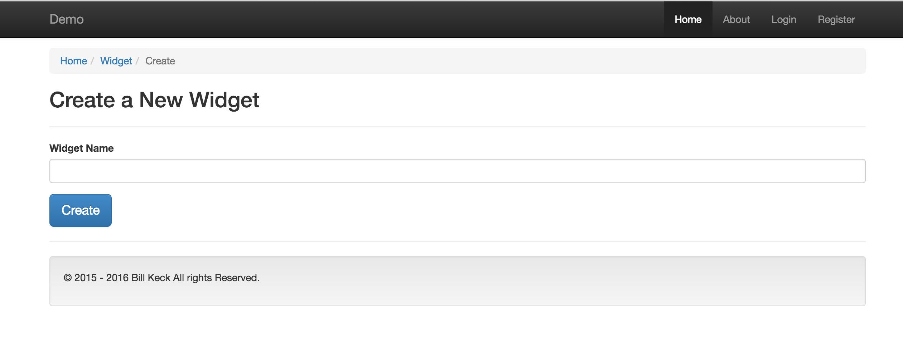
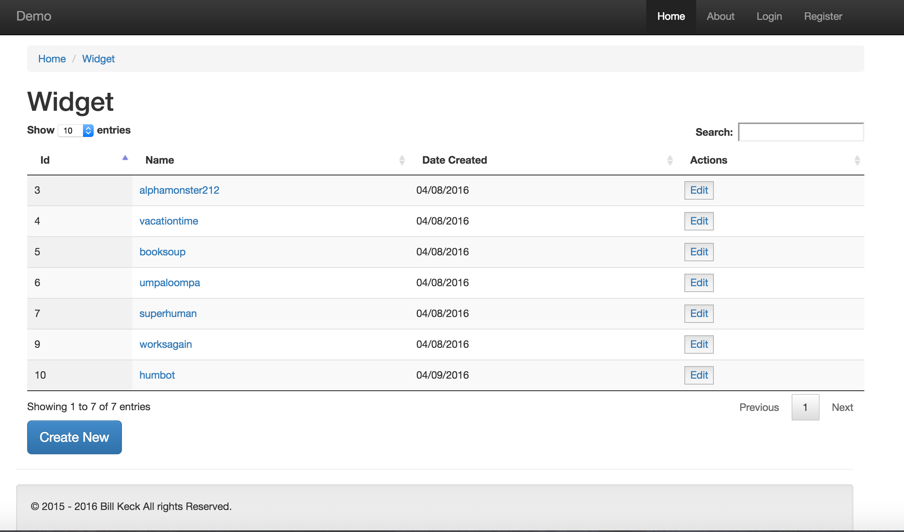

# ViewMaker

[![Latest Version on Packagist][ico-version]][link-packagist]
[![Software License][ico-license]](LICENSE.md)
[![Total Downloads][ico-downloads]][link-downloads]


ViewMaker creates an artisan command that lets you quickly scaffold views for create, show, edit, and index, based on your input.

If you had a model named Widget, and you had a REST controller, you would want correspoing views
for the controller methods.
You simply input a model name, master page name and template type (plain, basic, or dt), and the 
the view folder and the views are made for you instantly.

## Install

Via Composer

```
composer require evercode1/view-maker
```

In your app/config/app.php file, add the following to the providers array:

```
Evercode1\ViewMaker\ViewMakerServiceProvider::class,
```

## Usage

## Summary

ViewMaker creates an artisan command that lets you quickly scaffold views for create, 
show, edit, and index, based on your input.

The make:views command has  the following arguments:

```
php artisan make:views {modelName} {masterPageName} {templateType}
```

So for example, if you had a model named Widget, and a master page 
named master.blade.php, you may do one of the following:

```
php artisan make:views widget master plain
```

```
php artisan make:views widget master basic
```

```
php artisan make:views widget master dt
```

The plain template creates simple stubs, the basic template gives you a 
couple of working forms and the dt templates give you a working datatables 
grid implementation with search and column sorts.  

The templates are described in detail in the following sections.

## Plain Templates

Using plain for template type will  create a widget folder in your views 
directory, and then within that folder, the following files:

* create
* show
* edit
* index

All blade files will extend whatever value for master page that you inputted 
on the command.  In the example above, the master page is named master.blade.php, 
so we used 'master'.  

If for whatever reason you are not using a master page for your application, 
then you will have to go to each file and remove the @extends directive.
  
Since most applications will use a masterpage for common html markup, extending 
the master page is included in the plain templates.

When using plain as the template type, you get the view folder and and the 4 view 
files.  In each file, you get the extends directive and a single \<h1> tag,  
for example in create.blade.php, you would see:

"This is your Widget Create page"

And that’s it.  So use plain if you just want to stub out the folder and the files, 
this can still be a time-saver.

## Basic Templates

Many times, we need to do rapid prototyping, so we have a very simple and minimal 
bootstrap implementation named ‘basic’.   The artisan command is for that is as 
example:

```
php artisan make:views widget master basic
```

Using ‘basic’ for template type will  create a widget folder in your views directory, 
and then within that folder, the following files:

* create
* show
* edit
* index

This will give you an input forms for create and edit and a show page and a simple 
index page.



Above you can see that you are provided with a single input for widget name, which 
in the form will be labelled widget_name.  The convention for fieldname is 
$modelName . ‘_name’.  If you follow a different convention, then you will have to 
change the value of the field name in all the appropriate spots.  Please see the 
conventions section for tips on how the templates are formatted.

Note that that the header and footer in the sample above are brought in by extending 
the master page, they will not be generated by the ViewMaker.  

The action on the above form is set to POST  to /widget, with the appropriate token set 
to avoid csrf.  That actual posting of the form depends on you having a model, route, 
controller and db setup.  None of that is created for you by ViewMaker.  That said, 
these templates are designed to work with a route resource, so if you had the following 
in your routes file:

```
Route::resource('widget', 'WidgetController'):
```

That would obviously point to a WidgetController, which you have to make on your own.  
If you want the form to actually function, you need to write your update method on your 
controller.  

You can see a basic implementation of the model, migration, route, and controller that 
support the basic views at:

[demo](https://github.com/evercode1/package-for-views)

Please note that is the code on github, not a live demo.

Since the templates only provide for a single field, it is easy to add fields, modify 
the html markup and css to suit your own tastes and needs.  Using the make:views command 
is a starting point that will get you up and running quickly.

## Datatables Templates

Sometimes we need to do quick prototyping of data grids.

Our dt template is a simple implementation of jquery datatables, which can get you up 
and running quickly with a sortable, searchable grid.  The command for that looks like 
this:

```
php artisan make:views widget master dt
```

Assuming you have some records, and have set up your route, model, migration, api route, 
and controller, that will get you the following:



Again note the header and footer are brought in by master page, which you create 
separately on your own.  If you need an example to follow, use the demo site at:

[demo](https://github.com/evercode1/package-for-views)

You can copy the master.blade.php and related files from there if you wish to.

When you run the make:views command with ‘dt’, you get two additional view pages.  
One is datatable.blade.php, which holds the table partial.  The other is 
datatable-script.blade.php, which holds the datatable script.

As long as you have included in your scripts in your master page or related files:

```
<script src="//cdn.datatables.net/1.10.7/js/jquery.dataTables.min.js"></script>
```

That has a jquery dependency, so you will need to put that after your jquery call.  
You also need the following css:

```
<link rel="stylesheet" href="//cdn.datatables.net/1.10.7/css/jquery.dataTables.min.css">
```
You also need a meta tag:

```
<meta name="csrf-token" content="{!! csrf_token() !!}">
```
You can see how I did all this in the demo app:

[demo](https://github.com/evercode1/package-for-views)

Please note that is the code, not a live demo.  But you can see how I structured the 
master page and the cdn calls.

The ViewMaker will get you up and running quickly, but you should move your 
datatable-script.blade js code to a permanent home, such as in public/js folder 
or assets/js or some other location for your js assets.  It’s up to you how you 
want to organize that.

In addition to having the route resource and matching controller, you also need a route 
for your api call, which again, using widget as an example, would be:

```
Route::any('api/widget', 'ApiController@widgetData');
```

This assumes you have a controller named ApiController.  I’m using any as the verb here 
so I can do a get request to debug.  You also need to format the json response a specific 
way,  so for example, you api controller could look like this:

~~~~

<?php

namespace App\Http\Controllers;

use Illuminate\Http\Request;

use App\Http\Requests;
use DB;

class ApiController extends Controller
{
   public function widgetData(){

       $result['data'] = DB::table('widgets')
                       ->select('id',
                                'widget_name',
                                'created_at')
                       ->get();

       return json_encode($result);

   }
}

~~~~

Obviously, you can add new columns to the select statement as you require them, as long 
as you have added them in your db.  You would also have to have a corresponding table 
row on your datatable.blade.php partial.  And of course you would have to modify your 
script to account for additional data.

Datatables is a popular jquery plugin, the docs are here:

[Datatables](https://datatables.net/)

## Conventions

For models with a single word, use the lowercase version of the word as the first 
argument of the command:

```
php artisan make:views widget master dt
```

In this case, widget represents the Widget model.  If you have model with compound 
words, such as AlphaWidget, then use the lowercase, separated by a dash:

```
php artisan make:views alpha-widget master dt
```

In such a case, your route would be:

```
Route::resource('alpha-widget', 'AlphaWidgetController');
```

The name of your view folder would also be alpha-widget, so in your controller 
methods, you do the following for create view for example:

~~~~

public function create()
{
   return view('alpha-widget.create');
}

~~~~

I have an example of this on the demo:

[demo](https://github.com/evercode1/package-for-views)

As I mention in the other section, the templates are built with a single field, 
with the following convention:

```
$modelName . '_name'
```

So that would mean that you have to have a widget_name column in your db.  A quick note 
on why I do it this way.  You could have several models with a name attribute.  By 
making the model part of the name of the attribute, there is never confusion between 
widget_name and product_name, for example, and that makes working with queries easier in the long 
run. 

This convention will work great in most cases, but obviously there are some case where 
it will have to be changed, for example if want to use it on a user model, you would end 
up with user_name, which in the migration in Laravel  is actually just ‘name’.  Stick with Laravel defaults if you can. 

So if you have situation like that or if you use a different convention, it’s ok, just 
change it after the files are made.  You will have to work on these files anyway, since 
it’s unlikely you will build models with a single field name.  At any rate, it’s meant 
to be a starting point, a fast way to get up and running.

I hope you have enjoy this plugin and find it useful.  I don’t have a donate button, but If you would like to support my work and learn more 
about Laravel, you can do so by buying one of my books, [Laraboot: laravel 5.2 For Beginners](https://leanpub.com/laravel-5-for-beginners-laraboot), I really appreciate it.

## Change log

Please see [CHANGELOG](CHANGELOG.md) for more information what has changed recently.


## Contributing

Please see [CONTRIBUTING](CONTRIBUTING.md) and [CONDUCT](CONDUCT.md) for details.

## Security

If you discover any security related issues, please email ikon321@yahoo.com instead of using the issue tracker.

## Credits

- [Bill Keck](https://github.com/evercode1)


## License

The MIT License (MIT). Please see [License File](LICENSE.md) for more information.

[ico-version]: https://img.shields.io/packagist/v/evercode1/view-maker.svg?style=flat-square
[ico-license]: https://img.shields.io/badge/license-MIT-brightgreen.svg?style=flat-square
[ico-travis]: https://img.shields.io/travis/evercode1/view-maker/master.svg?style=flat-square
[ico-scrutinizer]: https://img.shields.io/scrutinizer/coverage/g/evercode1/view-maker.svg?style=flat-square
[ico-code-quality]: https://img.shields.io/scrutinizer/g/evercode1/view-maker.svg?style=flat-square
[ico-downloads]: https://img.shields.io/packagist/dt/evercode1/view-maker.svg?style=flat-square

[link-packagist]: https://packagist.org/packages/evercode1/view-maker
[link-downloads]: https://packagist.org/packages/evercode1/view-maker/stats
[link-author]: https://github.com/evercode1

